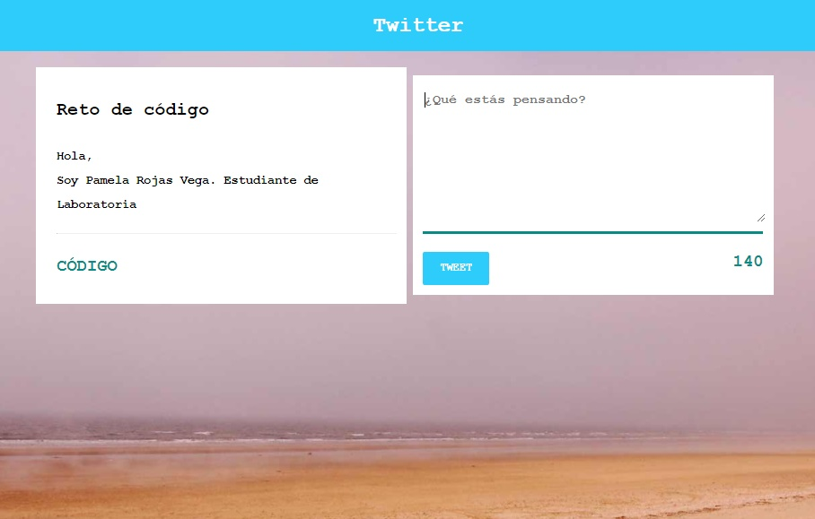

# Demo: "Twitter" #
En este ejercicio he replicado la funcionalidad de tweetear de la popular red social **'Twitter'**.
Pudiéndose añadir un texto de, como máximo, 140 carácteres e incluyendo la hora en la que ha sido publicada.  
El resultado es el siguiente:

